# 1

22年6月对着西瓜书撸的一颗决策树。

没有什么脑子，只会STL当时。所以实现起来相当丑陋。

# 决策树

基于树的结构进行决策

根节点为样本全集，叶节点为决策结果，每个结点是一个属性测试，每条边表示一次属性值的筛选。

树分治生成。

## 递归过程

属性，物体的某一个特征，颜色

属性值，在该特征上的取值，黄/绿/蓝/红

属性集，某个物体所有属性及其对应取值的集合。

类别，物体的种类，好瓜/坏瓜

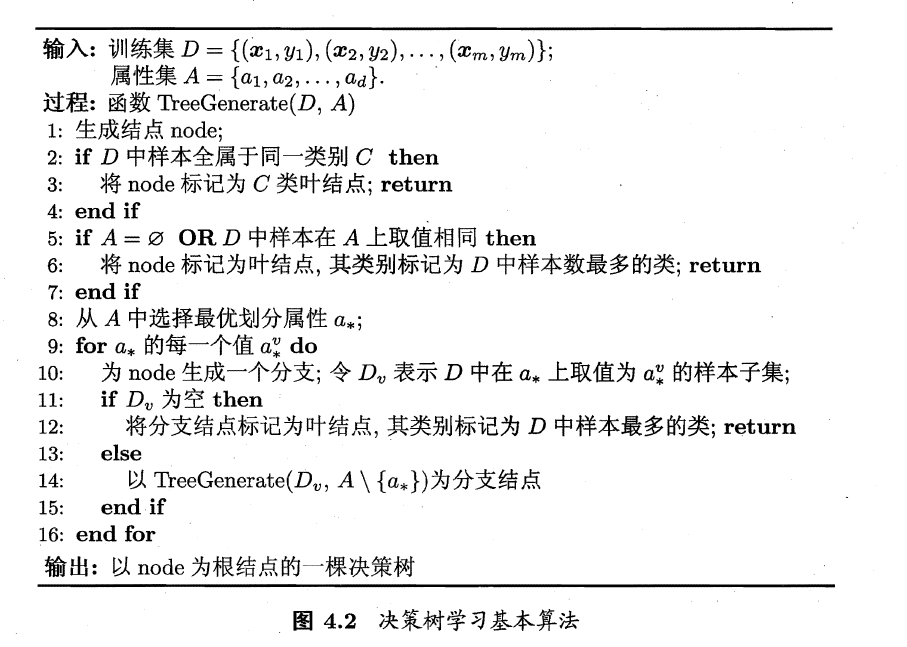

>A如果当前节点种包含的样本都是同一类的，比如好瓜/坏瓜
>
>那么可以当成叶结点，表示已经分类完成了
>
>B如果当前节点属性集为空集，或者说当前节点样本的属性都一样但是类别不一样，说明已经将所有属性分类用过了，但是仍不能将样本分好类，比如有属性集相同的四个瓜，其中三个好瓜/一个坏瓜，那么划分出当前的叶结点，类别就定为样本数最多的类，比如前面就定为好瓜。
>
>C如果不符合前面两种情况，那么找出一个合适的属性
>
>根据不同的属性值我们划分出子集，如果该子集为空集，其标记的类别就是训练集中最多的类。如果该子集部位空集，剔除当前用来划分的属性，继续递归。

## 寻找最合适的属性

我们希望划分出来的分支节点包含的样本尽可能属于同一类，也就是说希望划出来的子集中尽可能都是好瓜，或者尽可能都是坏瓜。即纯度。

### 信息增益

信息熵可以用来度量样本集合的纯度。值越小，集合D的纯度越高。

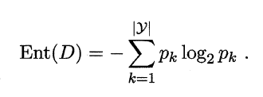

训练集D中有y个类别，第k个类别在训练集中占比为pk。本例中，训练集瓜中有好瓜和坏瓜两种类别。

信息增益越大，则使用该属性来划分得到的纯度提升更大。

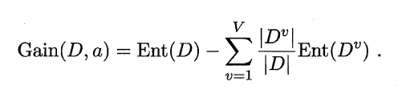

V表示一共有V个属性值可以选择，Dv表示取属性值为v的D的样本子集。

ID3决策树学习算法，就是以信息增益为准则来选择划分属性。

### ID3决策树应用

计算好瓜坏瓜的信息熵

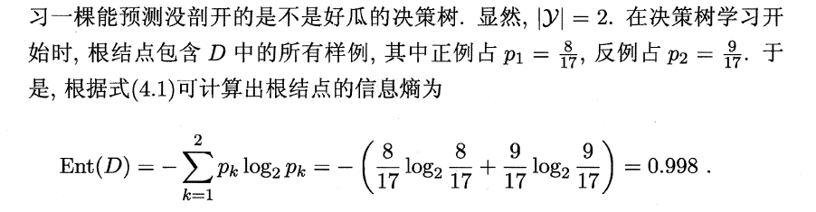


对于当前的根节点，我们有

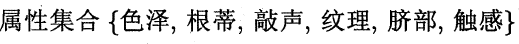

计算每个属性的信息增益，以便我们选择。

以计算色泽为例

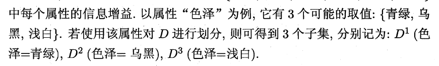

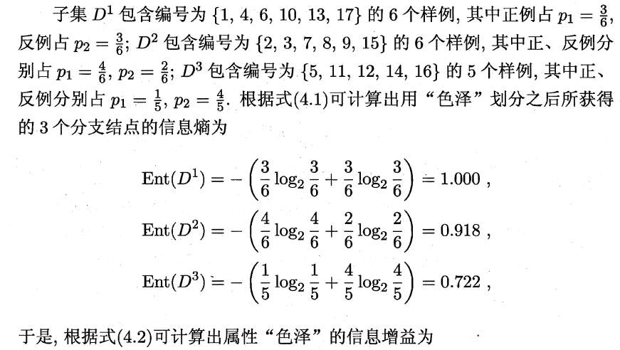

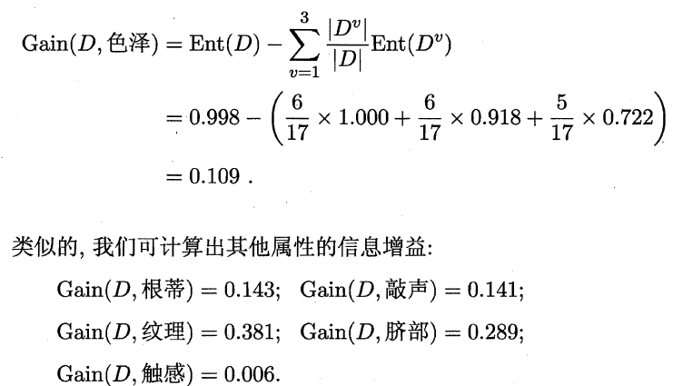

因此，选择纹理作为划分属性。

最后得到的决策树为。

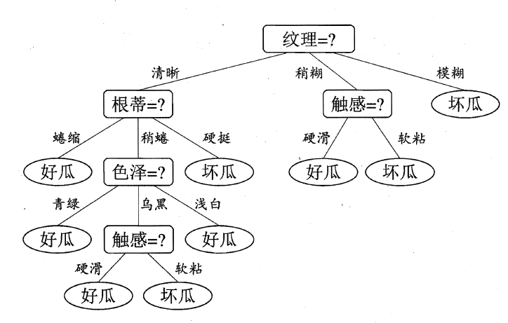


# 测试

**C4.5决策树二分法**

  对于某个属性的若干连续值，得出这些连续值中两两相邻的划分点。对于每个划分点，划分出该属性小于以及大于的两个子训练集Dv。有了Dv，类似离散值的处理可以实现。

**对于数据集的处理**

  随机的将数据集划分为train训练集和test数据集两部分

为了便于编写代码，通过打*注明该属性值为连续值。

属性以及属性值之间以’\t’划分

以西瓜数据集为例

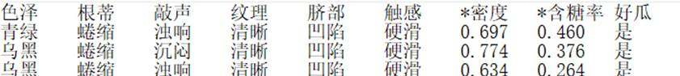

 

# 测试集上测试效果

所用数据集来自UCI网站

0 西瓜数据集

作为样例后文详细描述

## 1鸢尾花数据集

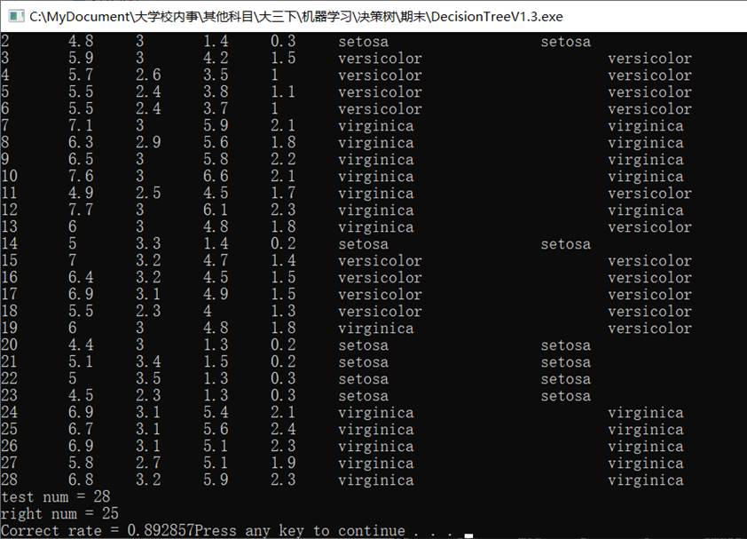

表格各个属性分别为序号，四个属性值（*Sepal.Length  *Sepal.Width  *Petal.Length *Petal.Width），预期类别，划分类别

训练集有143条数据

测试集有28条数据

分类成功率为0.892857

 

## 2 汽车评价数据集

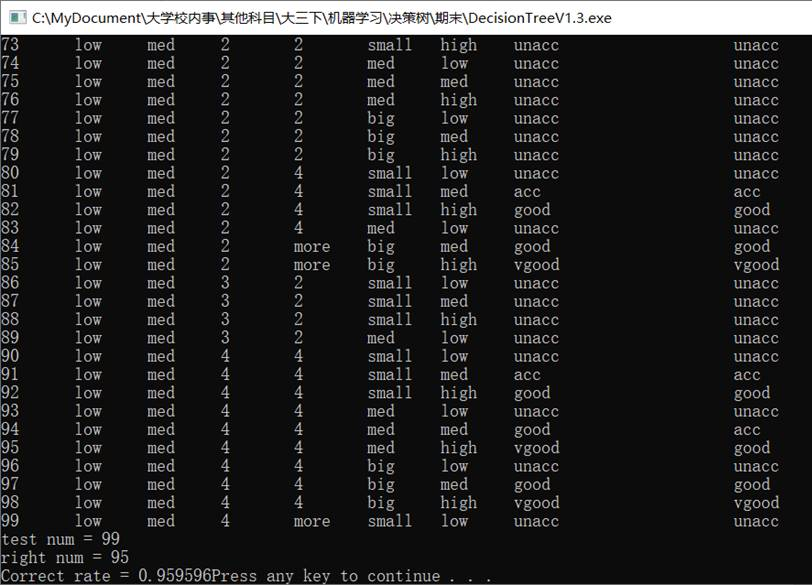

表格各个属性分别为序号，六个属性值（buying  maint doors persons  lug_boot  safety），预期类别，划分类别

训练集有1629条数据

测试集有99条数据

分类成功率为0.9595

## 3 生育能力数据集

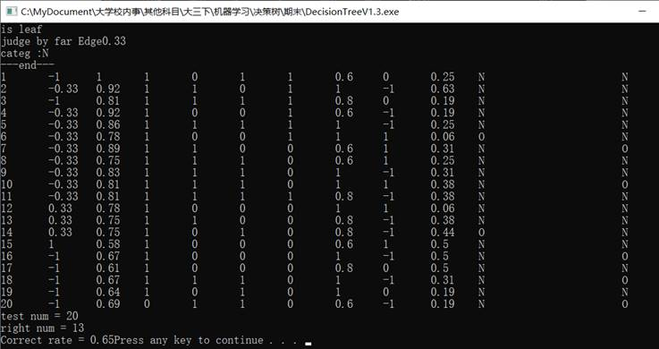

表格各个属性分别为序号，六个属性值（季节 *年龄 幼时得病  事故  手术 最近高烧  *饮酒频率 吸烟习惯  *坐着时间），预期类别，划分类别

训练集有80条数据

测试集有20条数据

分类成功率为0.65

# 代码流程

以西瓜数据集为例

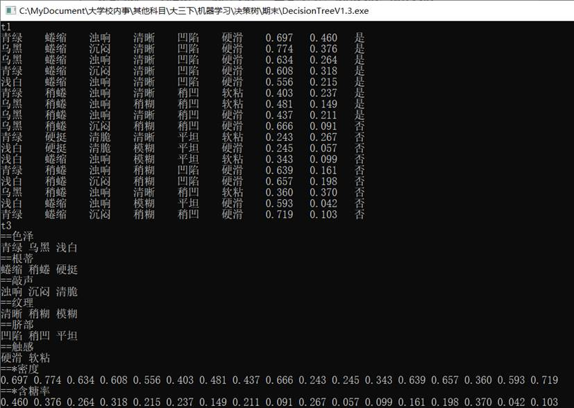

读入初始表t1

对属性的取值进行分类得到表t3

 

寻找合适的分类属性

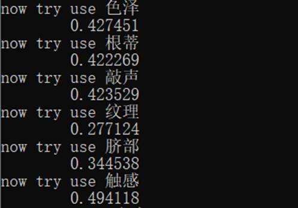

对离散值计算基尼指数

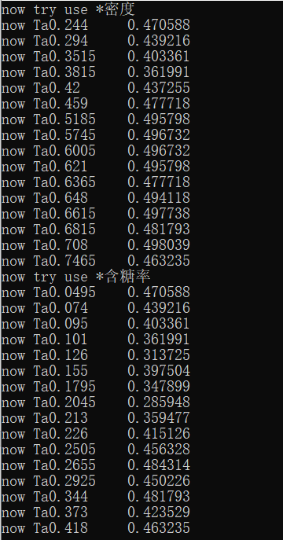

对连续值的各个划分点计算基尼指数

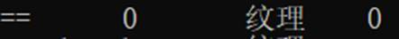

选择为纹理

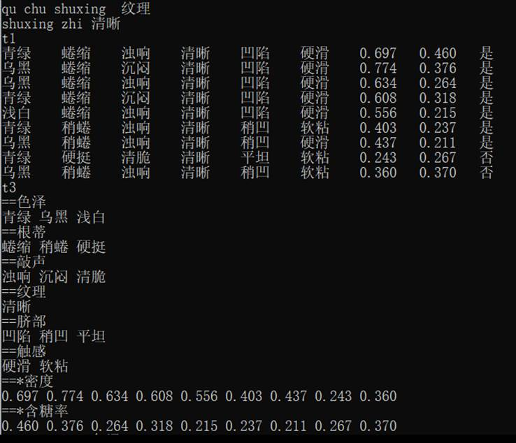

生成树的新节点

继续划分表

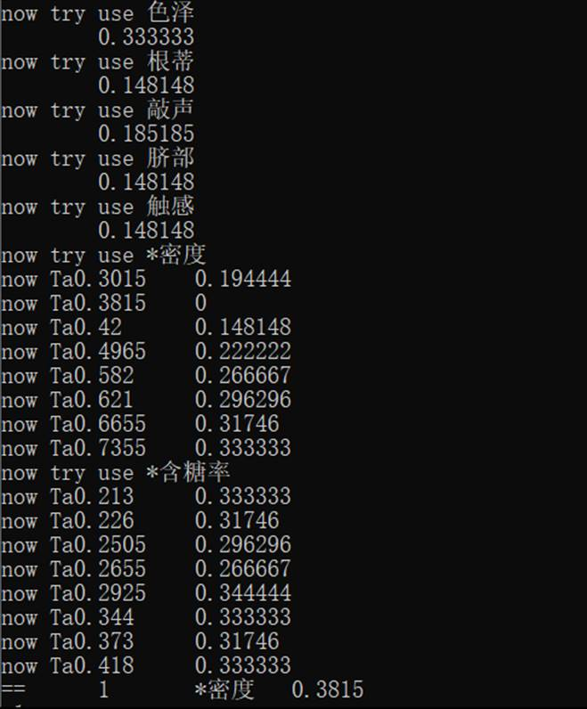

如上继续寻找合适标准

发现密度的划分点0.3815收益最高

 

继续递归子节点

小于密度划分点0.3815

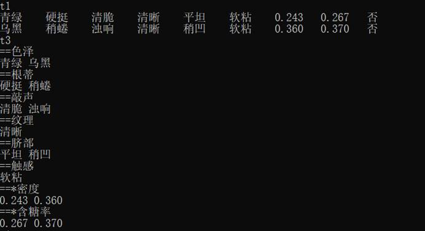

 

发现类别相同，标记为子节点

 

大于密度划分点0.3815

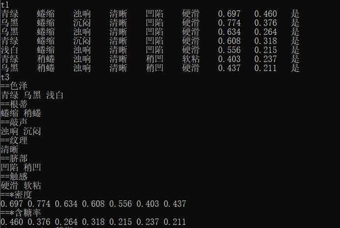

 

发现类别相同，标记为子节点

 

纹理清晰递归完毕

回到划分纹理的节点，选择属性为稍糊，继续递归

划分新表

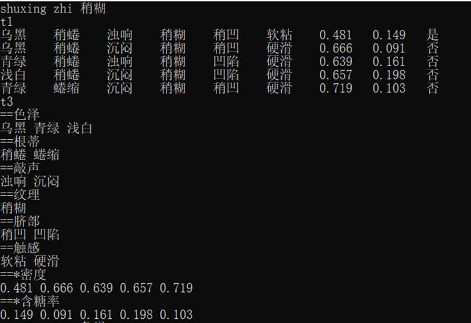

 

寻找标准

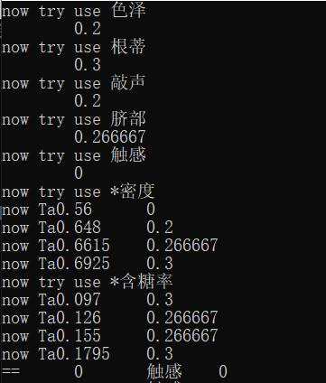

合适属性为触感

属性值为硬滑，划分一张表

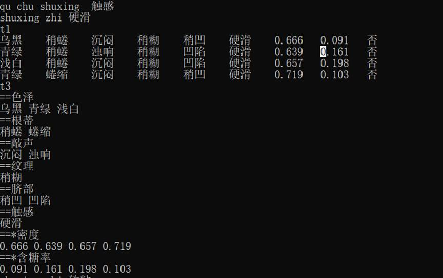

标记为子节点

属性值为软粘，划分一张表

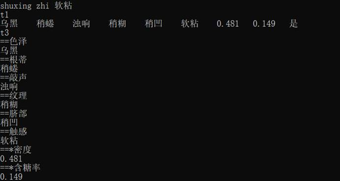

标记为子节点

回到标准为纹理的节点

属性值为模糊划分新表

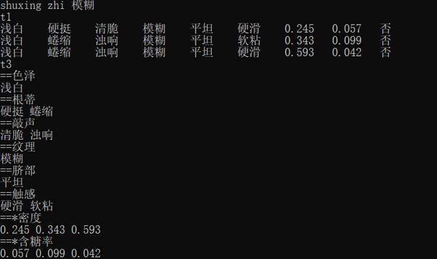 

建树完成


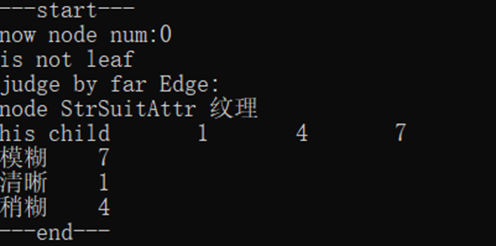

now node num:0   //当前为第0号节点

is not leaf        //不是叶子节点

judge by far Edge:  //被父节点划分的属性值无

node StrSuitAttr 纹理  //合适的划分属性为纹理

his child    1    4    7//儿子节点有

模糊  7       //若属性值为模糊，则递归7号节点

清晰  1       //若属性值为清晰，则递归1号节点

稍糊  4       //若属性值为稍糊，则递归4号节点

 

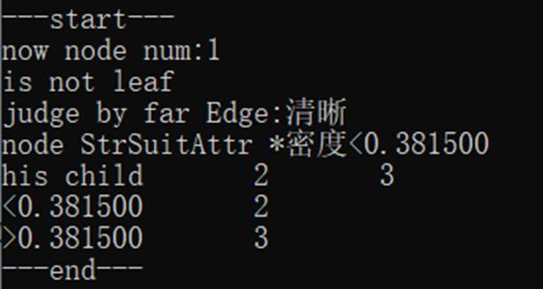

now node num:1         //当前为第1号节点

is not leaf              //不是叶子节点

judge by far Edge:清晰    //被父节点划分的属性值为清晰

node StrSuitAttr *密度<0.381500   //合适的划分标准为密度小于<0.381500

his child    2    3    //儿子节点有2 3节点

<0.381500    2         //小于0.381500   递归2号节点

\>0.381500    3         //大于0.381500   递归3号节点

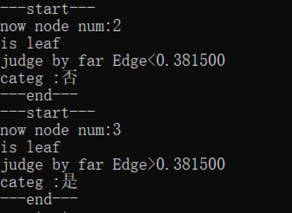

---start---

now node num:2      //当前为第2号节点

is leaf              //是叶子节点

judge by far Edge<0.381500   //被父节点划分的属性值为小于0.38150

categ :否                 //标签为否

---end---

---start---

now node num:3      //当前为第3号节点

is leaf           //是叶子节点

judge by far Edge>0.381500 //被父节点划分的属性值为大于0.38150

categ :是                 //标签为是

---end---

 

最后结构如书上所示

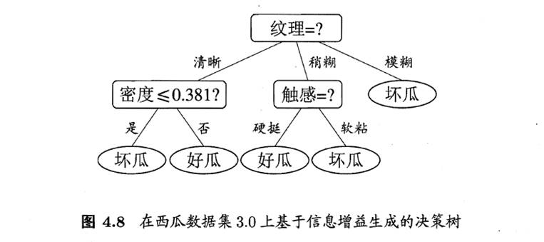

但是我认为触感的好瓜坏瓜划分书上标注错了

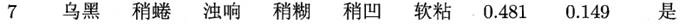

数据集中仅此一条稍糊且软粘，是好瓜

其他的稍糊且硬挺的瓜，多是坏瓜

```c++
/*
0 西瓜数据集
1 鸢尾花数据集
2 汽车评价数据集
3 生育能力数据集

*/

#include<bits/stdc++.h>
#include <windows.h>
#include <stdio.h>
#define debug(x)	cout<<"debug	"<<x<<"\n";

using namespace std;

struct AttrTable{//表 
	string FarEdg;//对于父亲节点标准的取值 	清晰/稍糊/模糊 
	vector<string> AttrNameList;//属性名
	vector<int> AttrNameUsed;//属性是否使用 0未使用过 1使用过  2连续值
	vector<vector<string> > RowData;//横向存一次表 
	vector<vector<string> > ColData;//纵向存一次表 
	
	map<string, vector<string> > AttrAllVal;//某个属性所有可能的取值 
	
	//纵向存表 
	void restore(){
		int ii =  RowData.size();
		int jj = AttrNameList.size();
		for(int j = 0;j < jj; ++j){
			vector<string> now;
			for(int i = 0;i < ii; ++i){
				now.push_back(RowData[i][j]);
			}
			ColData.push_back(now);
		}
	}
	
	//获取属性所有可能取值 
	void getallval(){
		//不同属性值丢进不同map 
		map<string, map<string,int > >  MpAttrJudge;
		for(int i = 0;i < ColData.size() - 1; ++i){//类别信息除外 
			for(int j = 0;j < ColData[i].size(); ++j){ 
				//属性，属性值对 没取过 
				if(MpAttrJudge[ AttrNameList[i] ][ ColData[i][j] ] == 0){
					MpAttrJudge[ AttrNameList[i] ][ColData[i][j]] = 1;
					AttrAllVal[ AttrNameList[i] ].push_back(ColData[i][j]);
				}
			}
		}
	}
};

struct node{//结点 
	int num;//编号
	
	vector<int>	child; //儿子节点列表 
	map<string,int > way;//对于给定的属性值，选择某个儿子递归 
	
	bool flag = false;//是否叶结点
	string catg;//叶子节点记录类别 
	
	int SuitAttr;//划分的标准是第几个
	string StrSuitAttr;//划分的标准 
	string Edge;//对于父亲节点标准的取值 	清晰/稍糊/模糊 
};

struct Find{
	int type;//0离散 1连续 
	int idx;//第idx个属性
	string Sattr;//属性字符串 
	double divi;//连续值的划分点 
}; 

AttrTable OrigiTable;//初始的训练集D 
vector<node> tr;//树
int tridx = -1; 
double ContiJudge = 0.0; 
 
void test(AttrTable tab){
	cout<<"t1\n";
	for(int i = 0;i < tab.RowData.size(); ++i){
		for(int j = 0;j < tab.RowData[i].size(); ++j){
			cout<< tab.RowData[i][j]<<"	";
		}
		cout<<"\n";
	}
//	cout<<"t2\n";
//	for(int i = 0;i < tab.ColData.size(); ++i){
//		for(int j = 0;j < tab.ColData[i].size(); ++j){
//			cout<< tab.ColData[i][j]<<"	";
//		}
//		cout<<"\n";
//	}
	cout<<"t3\n";
	for(int i = 0;i < tab.AttrNameList.size() - 1; ++i){
		cout << "==" << tab.AttrNameList[i] <<"\n";
		for(int j = 0;j < tab.AttrAllVal[ tab.AttrNameList[i] ].size(); ++j){
			cout<< tab.AttrAllVal[ tab.AttrNameList[i] ][j]<<" ";
		}
		cout << "\n";
	} 
}
void read(){//读数据
	SetConsoleOutputCP(65001);
	ifstream in("train3.txt");
	string s="";
	
	bool flag = true;//属性行标志 
	while(getline(in,s)){
		vector<string> now;
		//每次读入一行 
		int pre = 0;
		for(int i=0;i < (int)s.size(); ++i){
			if(s[i] == '\t'){
				string blo = s.substr(pre,i - pre);//切割出块 
				now.push_back(blo);
				pre = i + 1; 
			}
		}
		string blo = s.substr(pre,(int)s.size() - pre);//行末块 
		now.push_back(blo);
		
		if(flag){
			OrigiTable.AttrNameList = now;
			flag = false;
		}
		else{
			OrigiTable.RowData.push_back(now);
		}
	}
	
	OrigiTable.restore();
	OrigiTable.getallval();
	
	for(int i=0;i < OrigiTable.AttrNameList.size() ; ++i){
		if(OrigiTable.AttrNameList[i][0] == '*'){//连续值 
			OrigiTable.AttrNameUsed.push_back(2);
		}
		else{
			OrigiTable.AttrNameUsed.push_back(0);
		}
	}
}

string FindAttrMax(AttrTable tab){//找到当前D中样本最多的类 
	int las = (int)tab.ColData.size() - 1;
	map<string,int> mp;
	for(int i=0;i < tab.ColData[las].size(); ++i){
		mp[tab.ColData[las][i]] ++ ;
	} 
	int maxx = -1;string ans = "";
    for(auto &it : mp){
    	if(maxx < it.second){
    		maxx = it.second;
    		ans = it.first;
		}
    }
	return ans; 
}

double Gini(AttrTable tab){//计算 Gini(D) 
	double GiniD = 0.0;
	int sum = tab.RowData.size();
	int las = (int)tab.ColData.size() - 1;//类别 
	map<string,int> mp;//类别计数器 
	for(int i=0;i < tab.ColData[las].size(); ++i){
		mp[tab.ColData[las][i]] ++ ;
	} 
	for(auto &u:mp){
		//u.second 每个类别的个数
		//	cout<<"pi"<<" "<<u.second<<"\n";
		double pk = (double)u.second / (double)sum;
		GiniD = GiniD + pk * pk;
	}
	GiniD = 1.0 - GiniD;
	return GiniD;
}

Find FindSuitAttr(AttrTable tab){//找到D最优的划分属性 
	Find ans;double MinGini = 1e8;
	for(int i = 0;i < tab.AttrNameList.size() - 1; ++i){//测试每一个没用过的属性a 色泽 
		if(tab.AttrNameUsed[i] == 1)	continue;
		cout<<"now try use " << tab.AttrNameList[i] <<"\n";
		
		if(tab.AttrNameUsed[i] == 2){//尝试的属性是连续值 
			vector<double> T,Ta;//临时，划分点 
			for(int j = 0;j < tab.AttrAllVal[ tab.AttrNameList[i] ].size(); ++j){//属性的不同值av 密度 
				string NowAttr =  tab.AttrAllVal[ tab.AttrNameList[i] ][j];//比如 0.814 
				T.push_back(stod(NowAttr));
			}
			sort(T.begin() , T.end());
			for(int j = 0;j < T.size() - 1; ++ j)	Ta.push_back( (T[j] + T[j+1])/2.0 );
			
			//尝试每一个划分点
			for(int j = 0;j < Ta.size() ; ++ j){
				double Tjudge = Ta[j];//划分点 
				cout << "now Ta" << Tjudge <<"	";
				
				AttrTable NewtabP,NewtabN;//正 负 
				NewtabP.AttrNameList = tab.AttrNameList;
				NewtabP.AttrNameUsed = tab.AttrNameUsed;
				NewtabN.AttrNameList = tab.AttrNameList;
				NewtabN.AttrNameUsed = tab.AttrNameUsed;
				
				for(int jj = 0 ;jj < tab.RowData.size(); ++jj){
					if(stod(tab.RowData[jj][i]) < Tjudge){
						NewtabN.RowData.push_back(tab.RowData[jj]);
					}
					else{
						NewtabP.RowData.push_back(tab.RowData[jj]);
					}
				}
				
				NewtabP.restore();
				NewtabP.getallval();
				NewtabN.restore();
				NewtabN.getallval();
				
				double Gini_index = 0.0;
				Gini_index =  (double)NewtabP.RowData.size()/(double)tab.RowData.size() * Gini(NewtabP);
				Gini_index = Gini_index + (double)NewtabN.RowData.size()/(double)tab.RowData.size() * Gini(NewtabN);
				
				cout  << Gini_index <<"\n"; 
				if(Gini_index < MinGini){
					MinGini = Gini_index;
					ans = {1,i,tab.AttrNameList[i],Tjudge};
				}
			}
		}
		else{//尝试的属性是离散值 
			double Gini_index =  0.0;
			for(int j = 0;j < tab.AttrAllVal[ tab.AttrNameList[i] ].size(); ++j){//属性的不同值av 颜色 
				string NowAttr =  tab.AttrAllVal[ tab.AttrNameList[i] ][j];//比如 乌黑 
				
				//以某个属性值av 划分出新表 
				AttrTable Newtab;
				Newtab.AttrNameList = tab.AttrNameList;
				Newtab.AttrNameUsed = tab.AttrNameUsed;
				for(int tt = 0; tt < tab.RowData.size(); ++tt){
					if(tab.RowData[tt][i] == NowAttr){
						Newtab.RowData.push_back(tab.RowData[tt]);
					}
				}
				Newtab.restore();
				Newtab.getallval();
				
				// 求和 |Dv|/|D| * Gini(Dv)  
				Gini_index = Gini_index + (double)Newtab.RowData.size() / (double)tab.RowData.size() * Gini(Newtab);
			}
			if(Gini_index < MinGini){
				MinGini = Gini_index;
				ans = {0,i,tab.AttrNameList[i],0.0};
			}
			cout << "	" << Gini_index <<"\n"; 
		}
	}
	cout <<"==	"<< ans.type <<"	"<<ans.Sattr <<"	"<<ans.divi<<"\n";
	return ans;
}

void DecisionTreerBuild(AttrTable tab,int fa,string edg){//训练集 父亲节点 对于父亲节点标准的取值 
	test(tab);
	
	//新建一个节点
	node Now;
	Now.num = ++ tridx;
	tr.push_back(Now);
	if(fa != -1){
		tr[Now.num].Edge = edg;
		tr[fa].child.push_back(Now.num);
		tr[fa].way[edg] = Now.num;
	}
	
	//判断当前节点训练集是不是包含的样本都是同一类 
	bool judge = true;
	for(int i = 1;i < (int)tab.RowData.size(); ++i){
		if(tab.RowData[0].back() != tab.RowData[i].back()){
			judge = false;	break;
		}
	}
	if(judge){//都为同类 
		tr[Now.num].flag = true;
		tr[Now.num].catg = tab.RowData[0].back();
		return ;
	}
	
	//属性集为空集 或者 当前训练集在当前的属性集上取值相同
	bool judge2 = true , judge3 = true;//2检测D中样本在A上取值相同 3检测A为空 
	for(int i = 0;i < (int)tab.ColData.size() - 1; ++i){//前面已经判过了分类，必定不相同 
		for(int j = 1;j < (int)tab.ColData[i].size(); ++j){
			if(tab.ColData[i][j] != tab.ColData[i][0]){
				judge2 = false;	break;
			}
		}
	}
	for(int i = 0;i < tab.AttrNameUsed.size(); ++i){
		if(tab.AttrNameUsed[i] != 1){//还有没用的 
			judge3 = false;	break;  
		}
	}
	if(judge2||judge3){
		tr[Now.num].flag = true;
		tr[Now.num].catg = FindAttrMax(tab);
		return ;
	}
	
	//寻找合适的划分标准 
	Find get = FindSuitAttr(tab);
	
	if(get.type == 0){//离散值 
		//合适的划分值 
		tr[Now.num].SuitAttr = get.idx;
		tr[Now.num].StrSuitAttr = get.Sattr;
		
		//相同属性值 放入同一vector 
		map<string, vector<int> > MpAttr;
		for(int i = 0;i < (int)tab.RowData.size() ; ++i){
			MpAttr[ tab.RowData[i][get.idx] ].push_back(i);
		}
		
		//不同的属性值创造不同的分支，注意这里属性值为初始D中可能的所忧取值 为所有可能的属性建树 
		cout<<"qu chu shuxing	"<< get.Sattr <<"\n";
		
		for(int i = 0;i < OrigiTable.AttrAllVal[get.Sattr].size(); ++i){//属性值的不同取值 
			string NowAttrVal =  OrigiTable.AttrAllVal[get.Sattr][i];
			cout<<"shuxing zhi "<< NowAttrVal <<"\n";
			
			AttrTable Newtab;
			Newtab.AttrNameList = tab.AttrNameList;
			Newtab.AttrNameUsed = tab.AttrNameUsed;
			Newtab.AttrNameUsed[ get.idx ] = 1;//属性已被使用 
			Newtab.FarEdg = NowAttrVal;//av
			for(int j = 0;j < MpAttr[NowAttrVal].size(); ++j){//载入新表 
				int rownum = MpAttr[NowAttrVal][j];
				Newtab.RowData.push_back(tab.RowData[rownum]);//输入属性值对应行 
			}
			
			//若新表为空，说明此时D中没有对应划分
			//为了保证建成的树具有对D中没有的数据的分类能力，建立一个叶子节点 
			if(Newtab.RowData.empty()){
				node Next;
				Next.num = ++ tridx;
				tr.push_back(Next);
				tr[Now.num].child.push_back(Next.num);
				tr[Now.num].way[NowAttrVal] = Next.num;
				tr[Next.num].flag = true;
				tr[Next.num].Edge = Newtab.FarEdg;
				tr[Next.num].catg = FindAttrMax(tab);
				return ;
			}
			else{
				Newtab.restore();//为空则不必要执行 
				Newtab.getallval();
				DecisionTreerBuild(Newtab,Now.num,Newtab.FarEdg);
			} 
		}
	}
	else{//连续值 
		tr[Now.num].SuitAttr = get.idx;
		tr[Now.num].StrSuitAttr = get.Sattr + "<" + to_string(get.divi);
		
		//小于 
		AttrTable Newtab;
		Newtab.AttrNameList = tab.AttrNameList;
		Newtab.AttrNameUsed = tab.AttrNameUsed;
	
		//连续值可以反复使用 
		
		Newtab.FarEdg = "<" + to_string(get.divi);//如 0.824 
		
		for(int i = 0; i < tab.RowData.size() ; ++i){
			if(stod(tab.RowData[i][get.idx]) < get.divi)
				Newtab.RowData.push_back( tab.RowData[i] );
		}
		
		//选择了划分点，那么一定存在着被划分的样本
		Newtab.restore();//为空则不必要执行 
		Newtab.getallval();
		DecisionTreerBuild(Newtab,Now.num,Newtab.FarEdg);
		
		//大于 
		AttrTable Newtab2;
		Newtab2.AttrNameList = tab.AttrNameList;
		Newtab2.AttrNameUsed = tab.AttrNameUsed;
	
		//连续值可以反复使用 
		
		Newtab2.FarEdg = ">" + to_string(get.divi);//如 0.824 
		
		for(int i = 0; i < tab.RowData.size() ; ++i){
			if(stod(tab.RowData[i][get.idx]) > get.divi)
				Newtab2.RowData.push_back( tab.RowData[i] );
		}
		
		//选择了划分点，那么一定存在着被划分的样本
		Newtab2.restore();//为空则不必要执行 
		Newtab2.getallval();
		DecisionTreerBuild(Newtab2,Now.num,Newtab2.FarEdg);
	}
}
void print(){
	for(int i = 0;i < tr.size(); ++ i){
		cout<<"---start---\n";
		cout<<"now node num:"<<tr[i].num<<"\n";
		if(tr[i].flag){
			cout<<"is leaf\n";
			cout<<"judge by far Edge"<<tr[i].Edge<<"\n";
			cout<<"categ :"<<tr[i].catg<<"\n";
		}
		else{
			cout<<"is not leaf\n";
			cout<<"judge by far Edge:"<<tr[i].Edge<<"\n";
			cout<<"node StrSuitAttr "<<tr[i].StrSuitAttr<<"\n";
			cout<<"his child	";
			for(int j = 0;j < tr[i].child.size();++j){
				cout<<tr[i].child[j]<<"	";
			}
			cout<<"\n";
			for(auto &it :tr[i].way){
				cout<<it.first<<"	"<<it.second<<"\n";
			}
		}	
		cout<<"---end---\n";
	}
}

string zj = "";//我不知道为啥 dfs返回值的话就会递归溢出
//所以外面放了一个静态 
void dfs(int u,vector<string> now){//树的编号 标签编号  
	if(tr[u].flag){
		cout<<"		"<<tr[u].catg<<"\n";
		zj = tr[u].catg;
		return ;
	}
	
	string wait = now[tr[u].SuitAttr];//待分类的属性值 
//	cout<<"----------"<<wait<<"\n";
	if(OrigiTable.AttrNameUsed[ tr[u].SuitAttr ] == 2){//当前节点属性值为连续 
		double waitd = stod(wait);
		int pos = tr[u].StrSuitAttr.find('<');
		string judges = tr[u].StrSuitAttr.substr(pos + 1);
		double judged = stod(judges);
		
		string go = "";
		if(waitd < judged){
			go = "<" + judges;
		}
		else{
			go = ">" + judges;
		}
		dfs(tr[u].way[ go ],now);
	}
	else{
		dfs(tr[u].way[ wait ],now);
	}
}
void op(){
	//测试
	ifstream in("test3.txt");
	string s="";
	int tot = 0;//测试条数
	int right_num = 0; 

	while(getline(in,s)){
		++tot;
		vector<string> now;
		
		int pre = 0;
		for(int i=0;i < (int)s.size(); ++i){
			if(s[i] == '\t'){
				string blo = s.substr(pre,i - pre);//切割出块 
				now.push_back(blo);
				pre = i + 1; 
			}
		}
		string blo = s.substr(pre,(int)s.size() - pre);//行末块 
		now.push_back(blo);
		
		cout<<tot<<"	";
		for(auto q:now)	cout<<q<<"	";
		
		dfs(0,now);
//		cout << "1debug" << zj <<"\n";
//		cout << "2debug" << blo <<"\n";
		if(zj == blo)	right_num ++;
	}
	cout<<"test num = " << tot<<"\n";
	cout<<"right num = " << right_num<<"\n";
	cout<<"Correct rate = " << ((double)right_num / (double)tot);
	system("pause");
}
void DecisionTree(){
	DecisionTreerBuild(OrigiTable,-1,"");
}  
int main(){
	read();
	DecisionTree();
	print();
	op();
	return 0;
}
```

